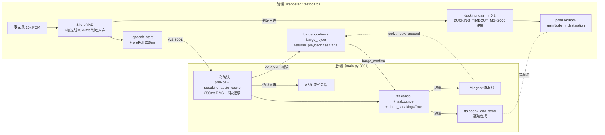

# 打断机制整体架构

## 双层分工
- **前端 Silero VAD**（renderer / testboard 浏览器）：体感层，检测到人声立即降低播放音量（ducking），并发 `speech_start` 给后端
- **后端 VAD + ASR**（main.py `_confirm_real_speech`）：业务层，二次确认是真人声还是回声/噪声，决定是否真打断

## 当前 Electron vs testboard 的关键差异

| 模块 | testboard | Electron VoicePipeline.ts |
|---|---|---|
| **ducking** | ✓ `startDucking()` 立即压音量 0.2 | ✗ 无（直接 gain=1）|
| **barge_confirm 处理** | 保持 ducking 静音**等结果**，再决定销毁/恢复 | `resetPlayback()` 立即销毁 |
| **新播报冲突防护** | `pendingBargeResume` 标记 + 3s 兜底 | 靠 `reply` / `tts_start` 的 resetPlayback |
| **old-audio dropping** | `pendingBargeResume` 期间忽略 `_onAudio` 数据 | 无（直接进时间线）|