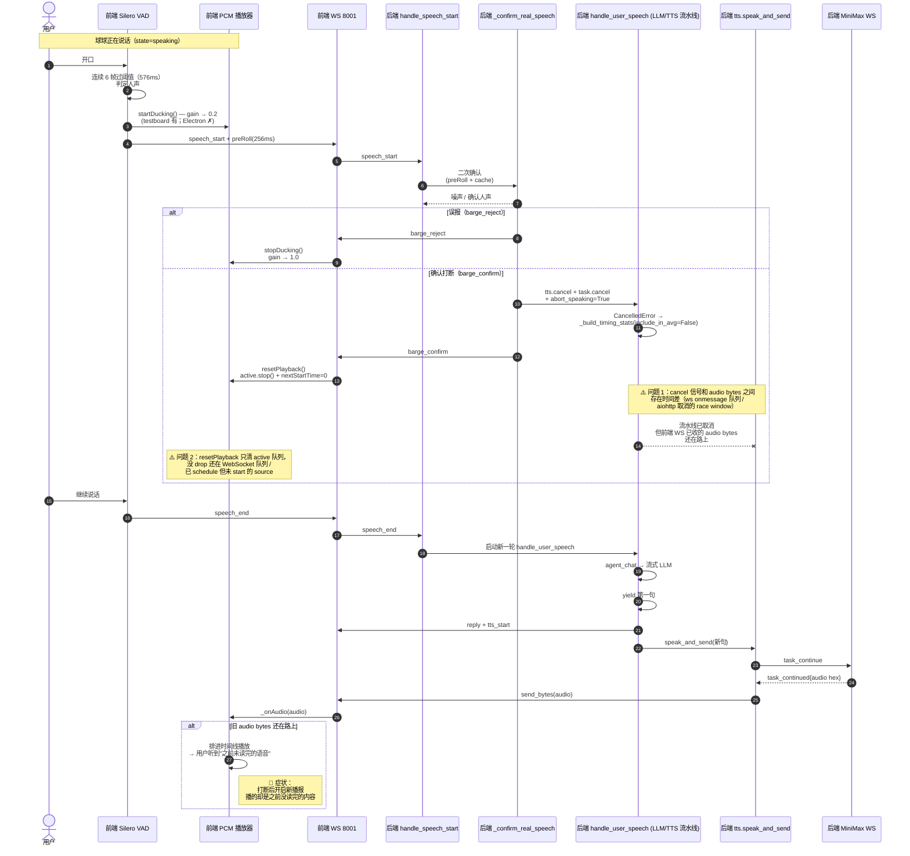

# 打断完整时序

## 参与者
- 用户（嘴巴）
- 前端 Silero VAD（Electron renderer / testboard 浏览器）
- 前端 PCM 播放器（AudioContext + GainNode + active sources）
- 前端 WS（8001 /ws/audio）
- 后端 handle_speech_start
- 后端 _confirm_real_speech
- 后端 handle_user_speech（LLM 流水线）
- 后端 tts.speak_and_send（逐句合成）
- 后端 MiniMax WS（长连接 TTS）

## 时序图

## 关键时序点

| t | 事件 | 前端动作 | 后端动作 |
|---|---|---|---|
| t0 | 球球开始播报 | reply + tts_start + 音频流 | LLM 流式 + TTS 逐句 |
| t1 | 用户开口（VAD 未触发） | （无） | （无） |
| t2 | 连续 6 帧过阈值（576ms）| **ducking**（testboard ✓ / Electron ✗）| （无）|
| t3 | 上报 speech_start | 发送 speech_start + preRoll | 收 speech_start |
| t4 | 二次确认（~16ms）| — | _confirm_real_speech |
| t5 | 二次确认通过 | — | cancel LLM/TTS + 发 barge_confirm |
| t6 | 收到 barge_confirm | **resetPlayback()**（清 active + 重置 nextStartTime）| — |
| t7 | 旧 audio bytes 到达（race window）| ⚠️ 进 _onAudio → 排进时间线播放 | — |
| t8 | 新一轮 LLM 第一句到达 | reply → resetPlayback → 播放新内容 | handle_user_speech → 流式 LLM |

## 问题边界（关键时间差）

- **t5→t6**（cancel 到 barge_confirm 到达）：几百 ms ~ 1s，前端 WebSocket 队列里可能有**未消费的 audio bytes**
- **t6→t7**（barge_confirm 处理到旧 audio 到达）：resetPlayback 已清 active，但旧 audio 已在 ws.onmessage 回调队列里 → 进 _onAudio → 时间线接续（nextStartTime=0 → startAt=currentTime+0.02）→ 正常播放
- **t7→t8**（旧 audio 播完到新内容到达）：旧 audio 是「打断前 LLM 已经生成、还没播完的部分」，**内容上属于旧轮**