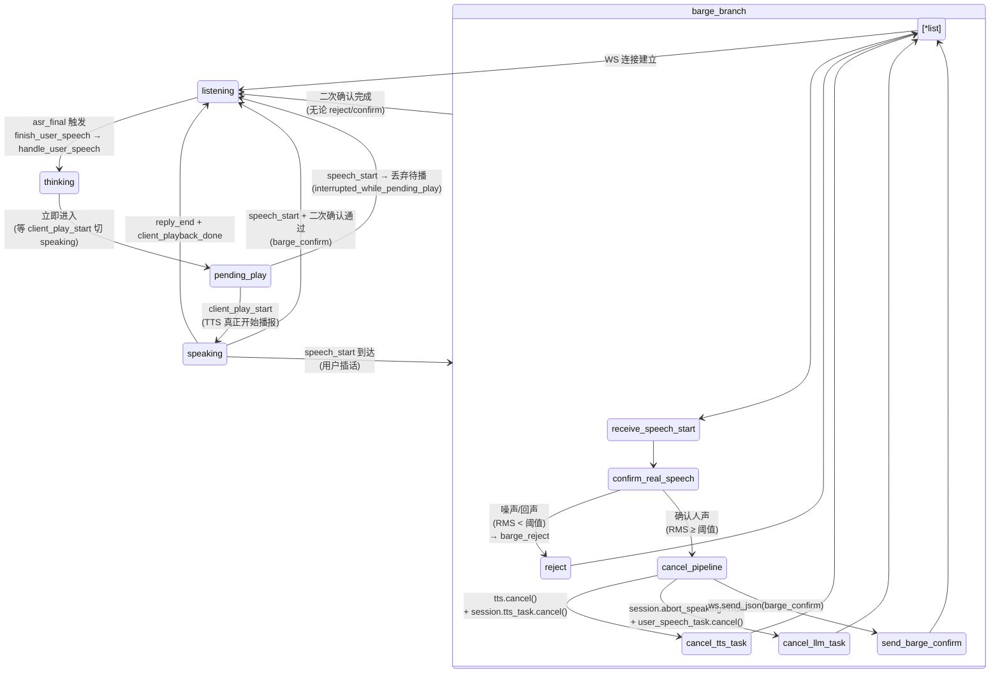

# 后端 state 机 + barge 分支



## 状态机关键路径说明

### 正常说话路径
```
listening → thinking → pending_play → speaking → listening
       (asr_final)   (handle_user_speech 入口)  (client_play_start)   (reply_end + client_playback_done)
```

### 打断路径（用户插话）
```
speaking → [_confirm_real_speech] → reject: barge_reject（恢复音量）
                                  → confirm: cancel LLM/TTS + barge_confirm → listening
```

### pending_play 打断（球球已下发但喇叭未响）
```
pending_play → speech_start 到达 → 直接丢弃待播任务 → listening
                                     （不走二次确认，~10ms 级响应）
```

## 三种结束语义（与 MiniMax 协议对齐）
- `is_final`：本条 audio 块结束
- `sentence_end`：本句结束（连接保持，长连接复用）
- `task_finished`：整个会话结束

## 三层时间点
- **6 帧过线 576ms**：前端 Silero VAD 判定人声（ducking 触发）
- **256ms 二次确认**：后端 _confirm_real_speech 决策窗口（实测 ~16ms）
- **120s 空闲**：bidi WS 服务端断连（2201）；客户端 25s ping 续命

## 误报兜底
- 前端 misfire → `vad_cancel` → 后端 reset ASR 会话 + 发 `asr_cancel` 给前端
- 前端 ducking 2s 兜底：超时无 confirm/reject → 强制恢复音量
- 后端 8s 兜底：speech_start 重复触发 + 距上次 8s → 重置说话状态（防防重入卡死）