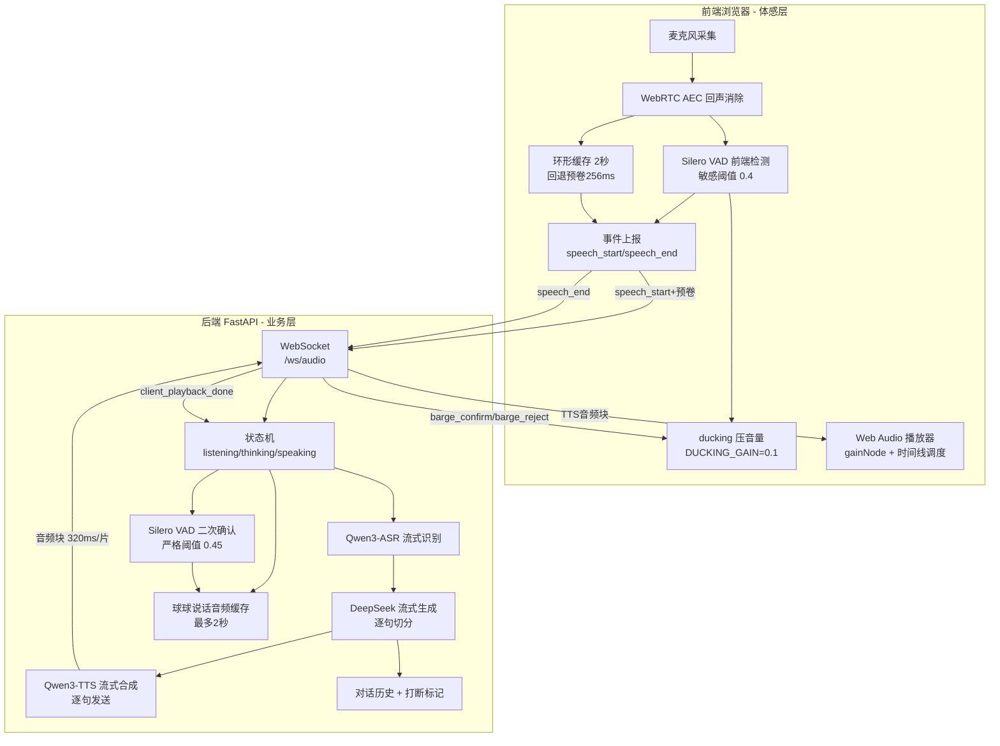
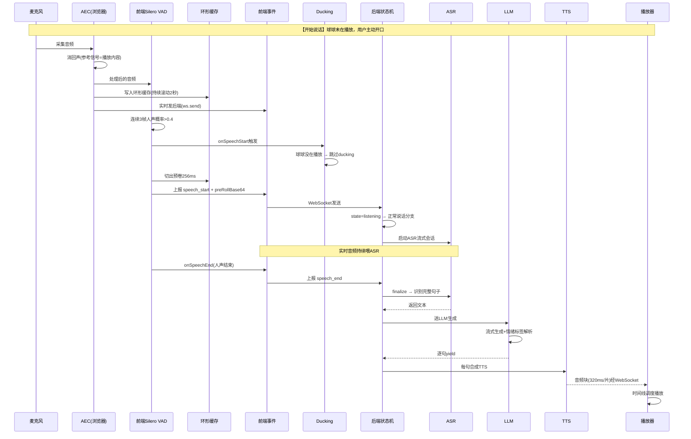
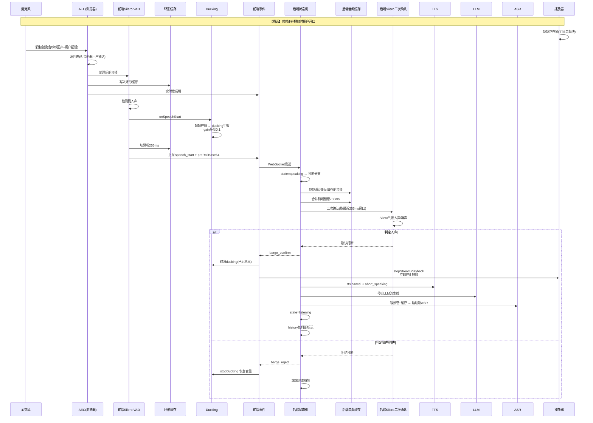
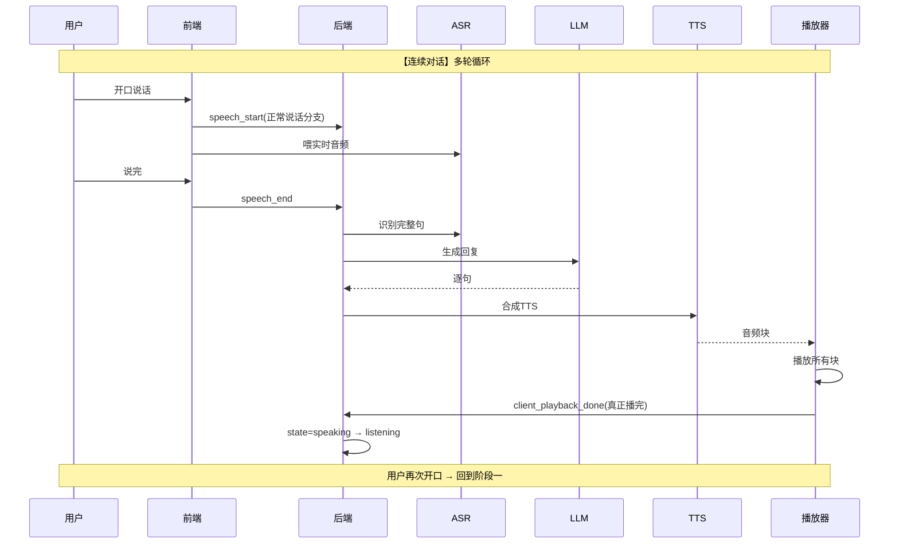
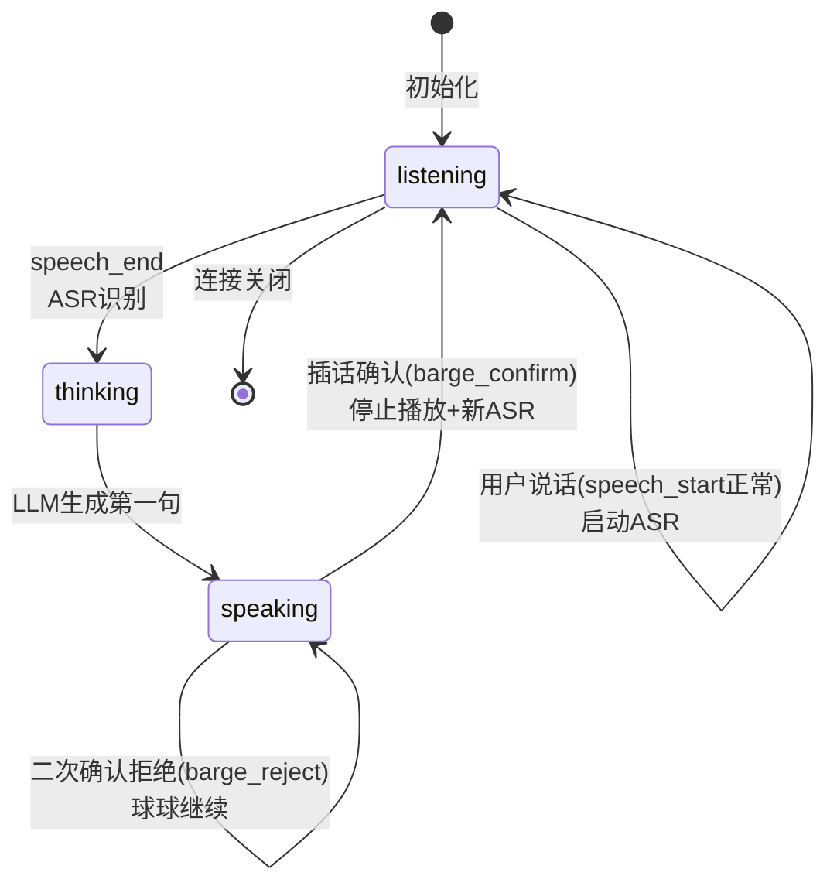

# AI 宠物「年年」语音管道架构图

## 三阶段总览

## 阶段一：开始说话（用户主动发起对话）

## 阶段二：插话打断（球球正在播放时用户开口）

## 阶段三：连续对话（多轮循环）

## 关键机制汇总

| 机制 | 位置 | 参数/阈值 | 作用 |
|------|------|-----------|------|
| AEC | 前端浏览器 | getUserMedia echoCancellation:true | 消回声(参考信号=播放内容) |
| 前端VAD | 前端 | 阈值0.4, 3帧确认 | 快速检测人声 |
| 环形缓存 | 前端 | 2秒滚动, 回退256ms | 补VAD延迟丢的首字 |
| Ducking | 前端 | DUCKING_GAIN=0.1 | 插话瞬间压音量(听觉反馈) |
| 后端VAD | 后端 | 阈值0.45, 人声占比0.05 | 二次确认人声/噪声 |
| ASR | 后端 | Qwen3-ASR-Flash-Realtime | 流式识别 |
| LLM | 后端 | DeepSeek 流式 | 生成+情绪标签 |
| TTS | 后端 | Qwen3-TTS-Instruct-Flash | 流式合成, 320ms/片 |
| 播放器 | 前端 | Web Audio 时间线 | 顺序播放音频块 |

## 状态机

